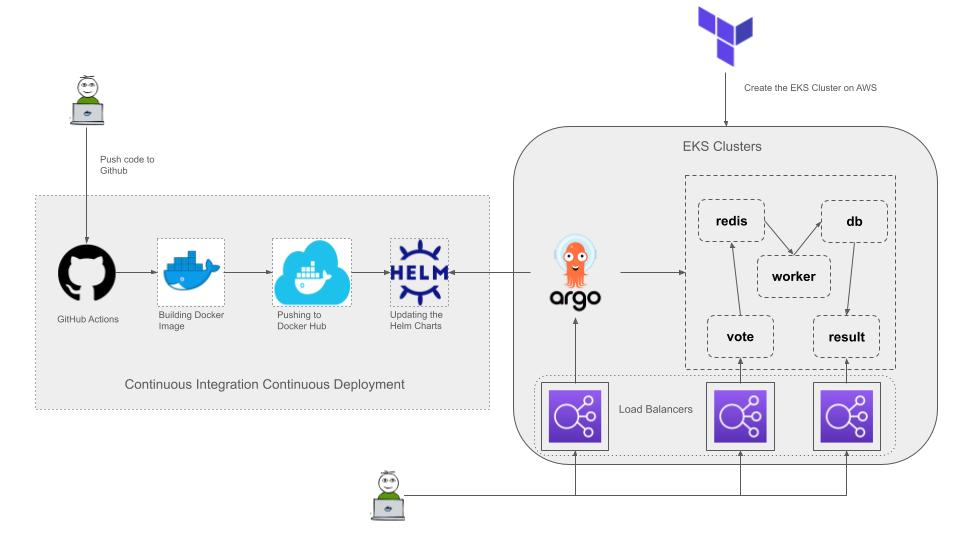

# Example Voting App

A simple distributed application running across multiple Docker containers.


* A front-end web app in [Python](/vote) which lets you vote between two options
* A [Redis](https://hub.docker.com/_/redis/) which collects new votes
* A [.NET](/worker/) worker which consumes votes and stores them in…
* A [Postgres](https://hub.docker.com/_/postgres/) database backed by a Docker volume
* A [Node.js](/result) web app which shows the results of the voting in real time

## Deployment Options
Since AWS is the preferred technology, we can explore options within the AWS on how to setup the development environment.
1. Using EC2 instances, we have to setup the Kubernetes clusters ourselves on the instances and have to manage everything ourselves. Though this provides control, it might be complex for a development setup.
2. Using ECS, it provides ease in deployment, scaling and requires minimal maintenance especially suitable for development environment. Only drawback is drifting away from traditional Kubernetes setup which this application follows and requires a lot of additional efforts in setting up.
3. Using EKS, it provides a fully managed Kubernetes clusters, the setup would be relatively easy compared to previous two for this application.

## Demo Example


### Setting up Infrastructure
1. There are various methods to setup the EKS clusters. One would be to either use the CLI or UI. Another would be to use terraform or CloudFormation.
2. Creating the EKS Clusters using CLI can be achieved through use of  simple command shown below. 
```
eksctl create cluster --name voting-app-cluster --region us-east-1
```
3. Alternatively, I am using Terraform to deploy  EKS clusters as we can later use the same workflow to deploy other AWS infrastructure if required. Also it helps maintain the state and gives control over the lifecycle management of the resources. Terraform determines and observes dependencies between resources. For example, if an AWS Kubernetes cluster needs a specific VPC and subnet configurations, Terraform will not attempt to create the cluster if it fails to provision the VPC and subnet first. 
4. I have used the following references to create the [Terraform Files](terraform): https://developer.hashicorp.com/terraform/tutorials/kubernetes/eks
5. Please note that we need prerequisites in order to provision the resources on AWS correctly. We need to make sure that we have 
	- Terraform v1.3+ installed locally
	- An AWS Account
	- AWS CLI  latest version installed and configured
	- kubectl installed
6. Deploy the EKS cluster using `terraform init` and `terraform apply` . This will provision the EKS cluster and also create the required resources.
7. Once the EKS cluster is created. Run the following command to retrieve the access credentials for our cluster and configure `kubectl`. We will be now able to use `kubectl` to manage the cluster.
```
aws eks --region $(terraform output -raw region) update-kubeconfig \
    --name $(terraform output -raw cluster_name)
```

### Setting up Helm
1. Since the Kubernetes manifests are already present. We can proceed with creation of Helm charts.
2. Created a sub-folder for [helm](helm) and ran the following command to create the Helm chart for the example voting app.
```
helm create example-voting-app-chart
```
3. Removed the contents under templates folder and copied the Kubernetes manifest files to this folder. Also made changes to the deployment files to get the image tags from the values.yaml file through Jinja2 templating. As this will be later useful for the CICD pipelines.
4. Updated the vote and result service yaml files to load balancer type.
5. We can test at this point to check if we are able to deploy the application using Helm charts.
```
helm install example-voting-app helm/example-voting-app/
```

### Setting up Github Actions
1. Created a ci-cd.yaml file under [.github/workflows](.github/workflows) directory.
2. Pre-requisites would be to configure the github repository to add the DockerHub credentials and Github token as secrets as these are used in the pipeline for authentication and authorization purposes.
3. The pipeline will be triggered when there is any push to the main branch of the repository.
4. For the sake of simplicity, created two jobs. One to build and push the docker images of the application to the docker hub and another to update the tag values of the images in the values.yaml file of helm chart whenever there is a new version of the image.

### ArgoCD
1. ArgoCD is used here to take care of the Continuous Deployment, as it allows you to automate and manage Kubernetes deployments. 
2. We need to install ArgoCD using kubectl:
```
kubectl create namespace argocd
kubectl apply -n argocd -f https://raw.githubusercontent.com/argoproj/argo-cd/stable/manifests/install.yaml
```
3. To Access the ArgoCD UI, we need to patch the arogcd-server service to change it into Loadbalancer:
```
kubectl patch svc argocd-server -n argocd -p '{"spec": {"type": "LoadBalancer"}}'
```
4. Get the Loadbalancer  service IP:
```
kubectl get svc argocd-server -n argocd
```
5. We can use this DNS of the loadbalancer to login to the ArgoCD.


6. To get the credentials, we can decode the password stored in argocd-initial-admin-secret using base64 decoding. 
7. Created the application in ArgoCD dashboard using the github repo URL. Set the sync policy to Automatic and also enable Self heal.


8. With ArgoCD, your deployment process is now more streamlined, fully automated, and provides better visibility and control over the deployment process. This setup ensures that your Kubernetes applications in EKS are always in sync with the state defined in your Git repository.
9. ArgoCD will now create the resources, verified by accessing the voting app and results app. 


### Testing CICD
1. We can test the CICD pipeline by making changes to the code and pushing them to the GitHub repository on the main branch. This will trigger the workflows and the tag values should be updated with the latest value. The argoCD will then pick up these changes automatically and update the Kubernetes resources.
2. I have made changes in voting and result code to change the voting options and then pushed my changes to the GitHub repository. This should trigger the CICD workflow in Github actions. 


3. This causes the app to be Out of Sync for a very brief moment in ArgoCD and it will fetch the new manifest files from the github repository to update the application.


4. Now, we have updated our voting app with new options. 


### Conclusion
This approach ensures a scalable, manageable, and automated development environment on AWS, leveraging modern DevOps practices to facilitate continuous deployment.

## Notes
The voting application only accepts one vote per client browser. It does not register additional votes if a vote has already been submitted from a client.

Use `terraform destroy` to destroy the aws resources created to avoid incuring extra charges.
